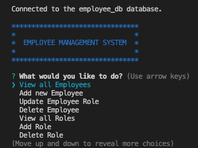
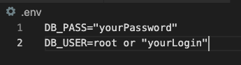

# Employee Management System

> A command-line application to manage a company's employee database, using Node.js, Inquirer, and MySQL.
> Demo [_here_](https://www.example.com).

## Table of Contents

- [General Info](#general-information)
- [Technologies Used](#technologies-used)
- [Dependencies](#dependencies)
- [Features](#features)
- [Screenshots](#screenshots)
- [Setup](#setup)
- [Usage](#usage)
- [Room for Improvement](#room-for-improvement)
- [Contact](#contact)
- [License](#license)

## General Information

> USER STORY
>
> AS A business owner
>
> I WANT to be able to view and manage the departments, roles, and employees in my company
>
> SO THAT I can organize and plan my business

The Employee Management System is a command-line application to manage a company's employee database, using Node.js, Inquirer, and MySQL. The user has the ability to view, add and delete employees, employee roles and departments.

## Technologies Used

- JavaScript
- Node.js

## Dependencies

- inquirer.js
- mysql2
- colors.js
- console.table
- dotenv

## Features

- View, add, delete and update employees
- View, add and delete employee roles
- View, add and delete departments

## Screenshots



## Setup

1. Git clone repository from the command line.

```shell
git clone https://github.com/lilyso/employee-management-system.git
```

2. Install dependecies by executing the following in your command line:

```
npm install
```

3. Set up your environment variables for your mysql database:



4. Set up your mysql database:

```shell
mysql -u root -p
(* Use "root" or preferred user login)

Enter Password:
(* Your mysql password)

source db/schema.sql

source db/seeds.sql
(* This is the test value file. Do not execute if not needed or enter your preferred values)
```

## Usage

To start using the Employee Management System, enter:

```
node index.js
```

Once executed, the employee management options will be displayed.

## Room for Improvement

Room for improvement:

- Ability to filter employees by manager.
- Ability to update employees by manager.
- Ability to view employees by department.
- Ability to view the total utilised budget of a department—in other words, the combined salaries of all employees in that department.

## Contact

Created by [@lilyso](https://github.com/lilyso) - feel free to contact me!

## License

This project is open source and available under the [MIT License](LICENSE).
